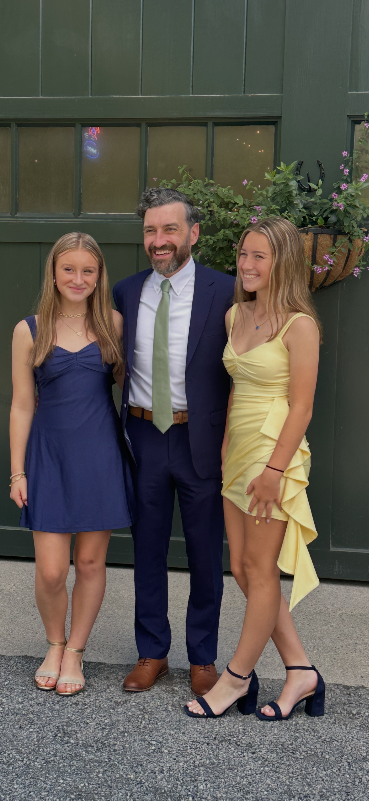

**A year of eating better.** It’s been about a year since I made a real effort to change how I eat, and I’ve lost more than 55 pounds. I’m now well within a healthy BMI and feel great. Along the way I cobbled together my own system using a few different apps and AI to help me make better choices and track what I was eating. What gets measured gets managed, and having that feedback along the way made a big difference for me.

This month I started turning that workflow into [MacroMigo](/builds/macromigo/), an app that brings it all into one simple experience. The goal is to make it easier to understand what you’re eating, make better choices, and keep track of where you stand without making the whole thing feel like work. Basically, I’m building the app I wish I had a year ago.

Over the last month, I’ve transitioned away from relying on Hermes and OpenClaw agents for most of my development work and moved primarily to Claude Code running on dedicated hardware. I have dedicated servers I can access remotely from my phone, so I can build, test, and deploy from pretty much anywhere at any time. So far it’s a much simpler setup and it’s been really effective for how I like to work. Things are changing so fast though, so we’ll see where this goes.

My younger brother got married this month. He’s my only brother, so it was a pretty big family milestone. It was a great night. I’m super excited and happy for him and my new sister-in-law!

Otherwise, I’m continuing to explore ideas and really enjoying this moment in time as a builder.

