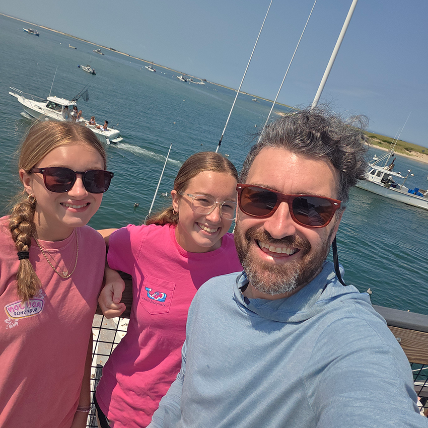

**Chasing dropping domains.** I’m building a system that spots good domains right before they expire. It parses the daily pending-delete lists, filters out the junk, and surfaces the few actually worth grabbing. The domain name world is a weird little corner of the internet that I've been playing in ever since I bought my first domain back in 1997!

**Running my own domain parking system.** I got tired of ugly parked pages, so I built my own setup. Custom nameservers, one clean for-sale page, no per-domain config. Point a domain at my nameservers and it just works. It’s handling hundreds of domains in my portfolio right now.

**Still working on [Turn Left](/builds/turnleft/).** My top-down NASCAR-style browser game. Chunky pixels, instant play, no app store. Every week it gets a little tighter.

**Continuing to build my agentic AI team.** This is what makes everything above possible. I have AI agents doing real engineering work. I write the specs, they ship the code, and I keep growing what the team can take on. The newest additions are [Parker](/agents/parker/), a product manager agent, and [Reed](/agents/reed/), who handles copywriting and social media. They’re not as hands-off as my engineering agents yet. Still a work in progress, but that’s the fun part.

**Cape Cod.** Spent a few days in Chatham and Yarmouth with my two daughters. Beach, sea food, shopping, ice cream, no agenda. Best part of the month.

